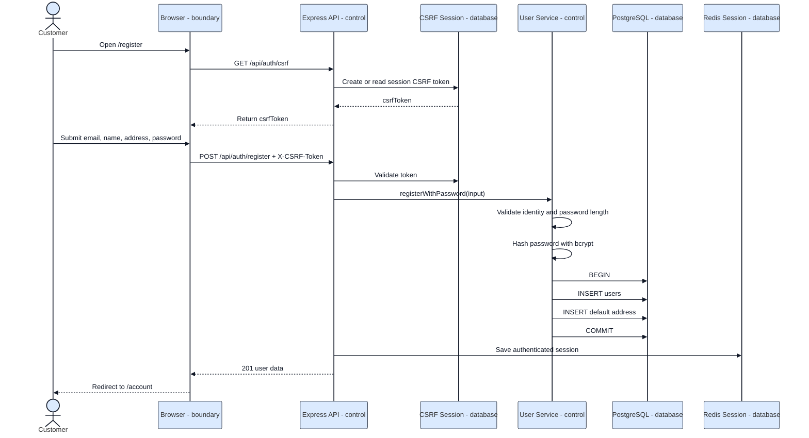

# Sequence 01 - Customer Registration

```mermaid
%%{init: {"theme": "base", "themeVariables": {"fontFamily": "Arial", "signalColor": "#111827", "signalTextColor": "#111827", "actorBkg": "#dbeafe", "actorBorder": "#111827", "actorLineColor": "#111827", "boundaryBkg": "#fef3c7", "boundaryBorder": "#111827", "controlBkg": "#dcfce7", "controlBorder": "#111827", "databaseBkg": "#ede9fe", "databaseBorder": "#111827", "activationBkgColor": "#bfdbfe", "activationBorderColor": "#111827", "labelBoxBkgColor": "#e5e7eb", "labelBoxBorderColor": "#111827"}}}%%
sequenceDiagram
    actor Customer
    participant Browser as Browser - boundary
    participant API as Express API - control
    participant CSRF as CSRF Session - database
    participant Users as User Service - control
    participant DB as PostgreSQL - database
    participant Redis as Redis Session - database

    Customer->>Browser: Open /register
    Browser->>API: GET /api/auth/csrf
    API->>CSRF: Create or read session CSRF token
    CSRF-->>API: csrfToken
    API-->>Browser: Return csrfToken
    Customer->>Browser: Submit email, name, address, password
    Browser->>API: POST /api/auth/register + X-CSRF-Token
    API->>CSRF: Validate token
    API->>Users: registerWithPassword(input)
    Users->>Users: Validate identity and password length
    Users->>Users: Hash password with bcrypt
    Users->>DB: BEGIN
    Users->>DB: INSERT users
    Users->>DB: INSERT default address
    Users->>DB: COMMIT
    API->>Redis: Save authenticated session
    API-->>Browser: 201 user data
    Browser-->>Customer: Redirect to /account
```

Related code: `src/routes/authRoutes.js`, `src/controllers/authController.js`, `src/services/users.js`.
