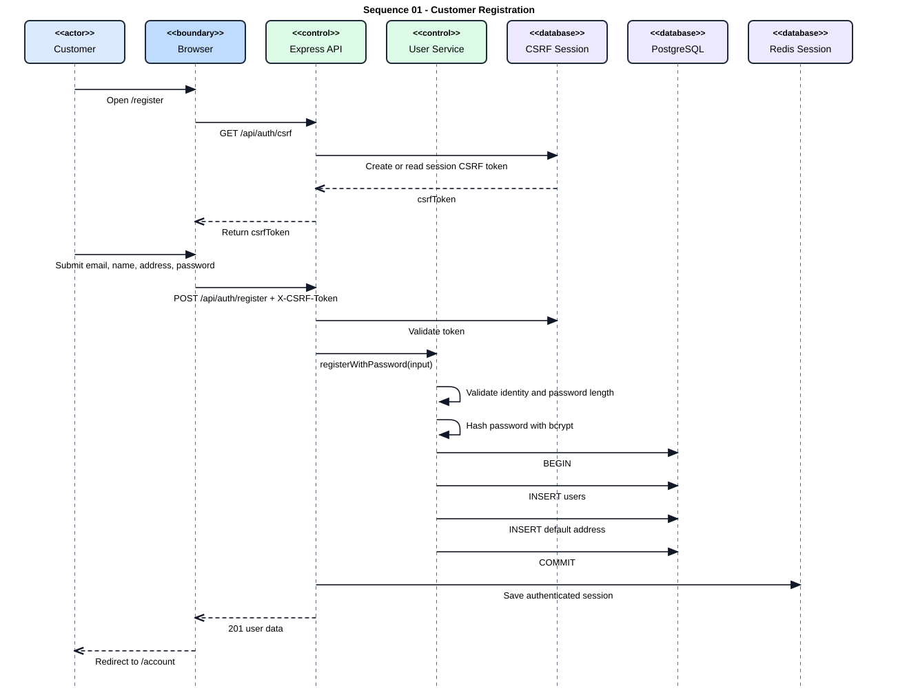
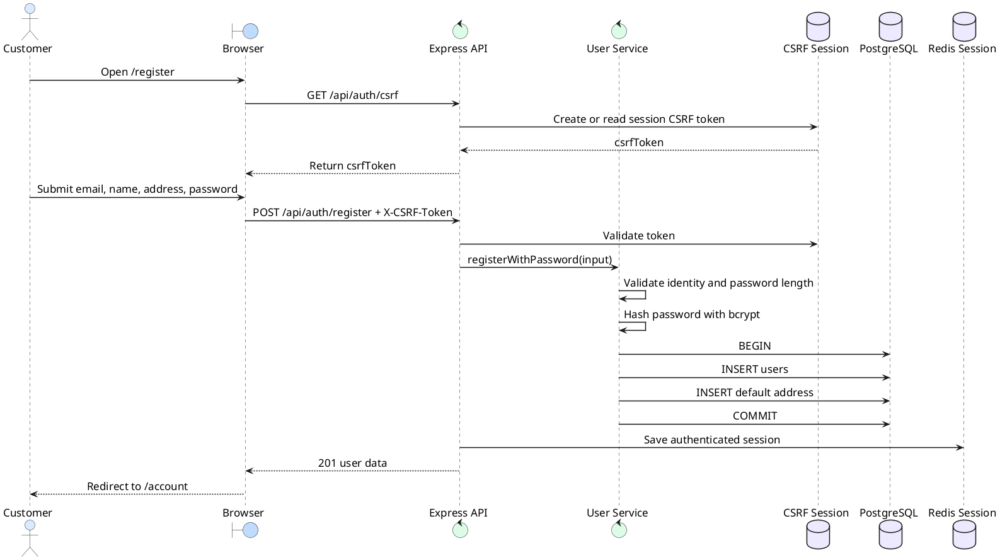

# Sequence 01 - Customer Registration

PlantUML source

```plantuml
@startuml
skinparam defaultFontName Arial
skinparam defaultFontSize 17
skinparam sequenceMessageAlign center
skinparam sequenceArrowThickness 1.5
skinparam ParticipantBorderColor #1F2937
skinparam ActorBorderColor #1F2937
skinparam LifeLineBorderColor #374151
skinparam LifeLineBackgroundColor #FFFFFF
actor "Customer" as Customer #DBEAFE
boundary "Browser" as Browser #BFDBFE
control "Express API" as API #DCFCE7
control "User Service" as Users #DCFCE7
database "CSRF Session" as CSRF #EDE9FE
database "PostgreSQL" as DB #EDE9FE
database "Redis Session" as Redis #EDE9FE
Customer -> Browser : Open /register
Browser -> API : GET /api/auth/csrf
API -> CSRF : Create or read session CSRF token
CSRF --> API : csrfToken
API --> Browser : Return csrfToken
Customer -> Browser : Submit email, name, address, password
Browser -> API : POST /api/auth/register + X-CSRF-Token
API -> CSRF : Validate token
API -> Users : registerWithPassword(input)
Users -> Users : Validate identity and password length
Users -> Users : Hash password with bcrypt
Users -> DB : BEGIN
Users -> DB : INSERT users
Users -> DB : INSERT default address
Users -> DB : COMMIT
API -> Redis : Save authenticated session
API --> Browser : 201 user data
Browser --> Customer : Redirect to /account
@enduml
```

Related code: `src/routes/authRoutes.js`, `src/controllers/authController.js`, `src/services/users.js`.