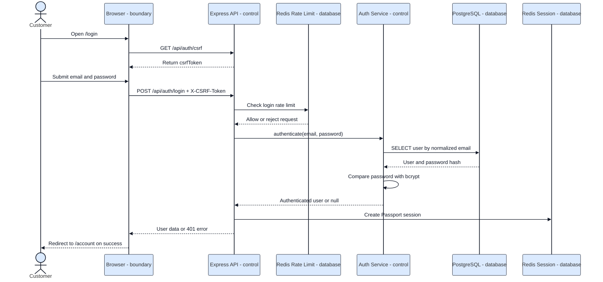

# Sequence 02 - Email Login

```mermaid
%%{init: {"theme": "base", "themeVariables": {"fontFamily": "Arial", "signalColor": "#111827", "signalTextColor": "#111827", "actorBkg": "#dbeafe", "actorBorder": "#111827", "actorLineColor": "#111827", "boundaryBkg": "#fef3c7", "boundaryBorder": "#111827", "controlBkg": "#dcfce7", "controlBorder": "#111827", "databaseBkg": "#ede9fe", "databaseBorder": "#111827", "activationBkgColor": "#bfdbfe", "activationBorderColor": "#111827", "labelBoxBkgColor": "#e5e7eb", "labelBoxBorderColor": "#111827"}}}%%
sequenceDiagram
    actor Customer
    participant Browser as Browser - boundary
    participant API as Express API - control
    participant Limit as Redis Rate Limit - database
    participant Auth as Auth Service - control
    participant DB as PostgreSQL - database
    participant Session as Redis Session - database

    Customer->>Browser: Open /login
    Browser->>API: GET /api/auth/csrf
    API-->>Browser: Return csrfToken
    Customer->>Browser: Submit email and password
    Browser->>API: POST /api/auth/login + X-CSRF-Token
    API->>Limit: Check login rate limit
    Limit-->>API: Allow or reject request
    API->>Auth: authenticate(email, password)
    Auth->>DB: SELECT user by normalized email
    DB-->>Auth: User and password hash
    Auth->>Auth: Compare password with bcrypt
    Auth-->>API: Authenticated user or null
    API->>Session: Create Passport session
    API-->>Browser: User data or 401 error
    Browser-->>Customer: Redirect to /account on success
```

Related code: `src/routes/authRoutes.js`, `src/controllers/authController.js`, `src/services/auth.js`, `src/middleware/rateLimit.js`.
