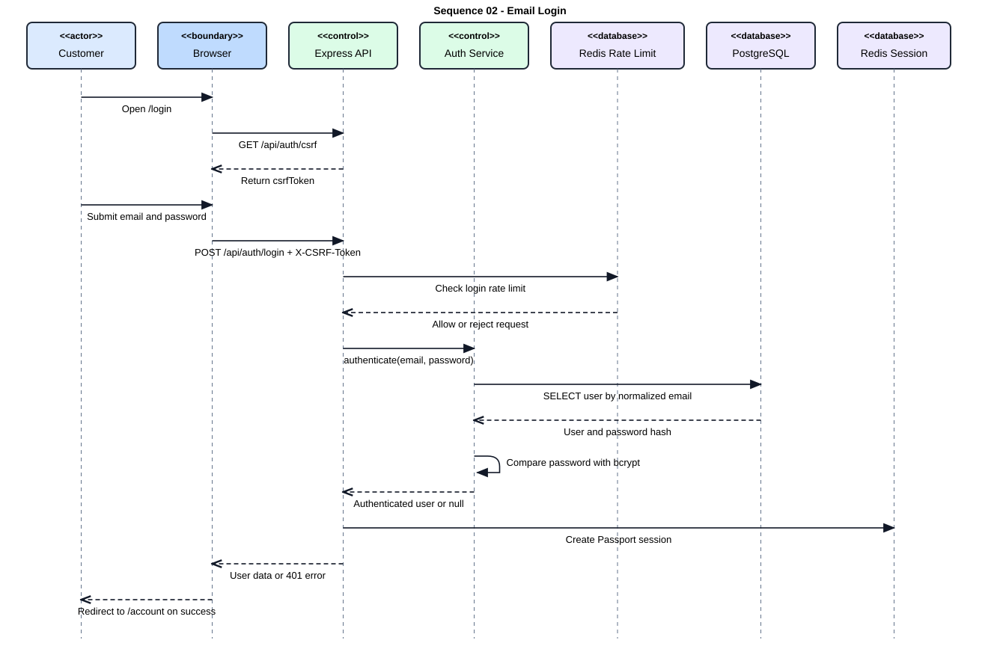
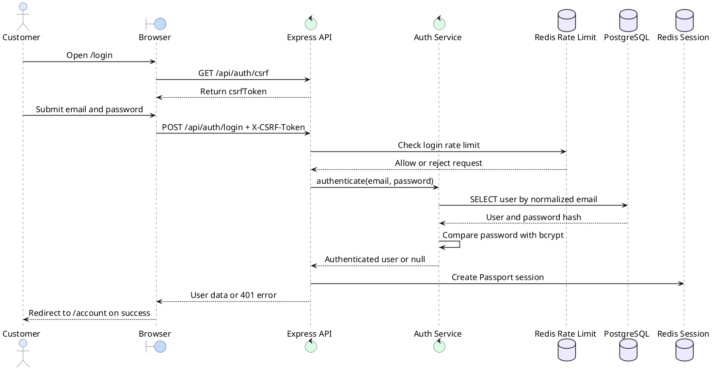

# Sequence 02 - Email Login

PlantUML source

```plantuml
@startuml
skinparam defaultFontName Arial
skinparam defaultFontSize 17
skinparam sequenceMessageAlign center
skinparam sequenceArrowThickness 1.5
skinparam ParticipantBorderColor #1F2937
skinparam ActorBorderColor #1F2937
skinparam LifeLineBorderColor #374151
skinparam LifeLineBackgroundColor #FFFFFF
actor "Customer" as Customer #DBEAFE
boundary "Browser" as Browser #BFDBFE
control "Express API" as API #DCFCE7
control "Auth Service" as Auth #DCFCE7
database "Redis Rate Limit" as Limit #EDE9FE
database "PostgreSQL" as DB #EDE9FE
database "Redis Session" as Session #EDE9FE
Customer -> Browser : Open /login
Browser -> API : GET /api/auth/csrf
API --> Browser : Return csrfToken
Customer -> Browser : Submit email and password
Browser -> API : POST /api/auth/login + X-CSRF-Token
API -> Limit : Check login rate limit
Limit --> API : Allow or reject request
API -> Auth : authenticate(email, password)
Auth -> DB : SELECT user by normalized email
DB --> Auth : User and password hash
Auth -> Auth : Compare password with bcrypt
Auth --> API : Authenticated user or null
API -> Session : Create Passport session
API --> Browser : User data or 401 error
Browser --> Customer : Redirect to /account on success
@enduml
```

Related code: `src/routes/authRoutes.js`, `src/controllers/authController.js`, `src/services/auth.js`, `src/middleware/rateLimit.js`.