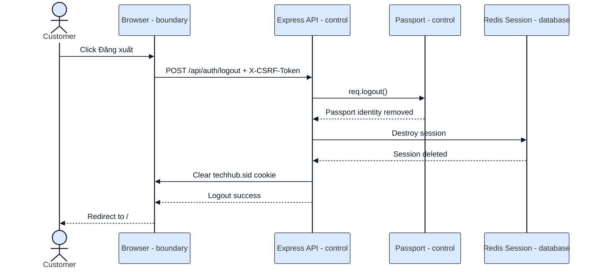

# Sequence 03 - Logout

```mermaid
%%{init: {"theme": "base", "themeVariables": {"fontFamily": "Arial", "signalColor": "#111827", "signalTextColor": "#111827", "actorBkg": "#dbeafe", "actorBorder": "#111827", "actorLineColor": "#111827", "boundaryBkg": "#fef3c7", "boundaryBorder": "#111827", "controlBkg": "#dcfce7", "controlBorder": "#111827", "databaseBkg": "#ede9fe", "databaseBorder": "#111827", "activationBkgColor": "#bfdbfe", "activationBorderColor": "#111827", "labelBoxBkgColor": "#e5e7eb", "labelBoxBorderColor": "#111827"}}}%%
sequenceDiagram
    actor Customer
    participant Browser as Browser - boundary
    participant API as Express API - control
    participant Passport as Passport - control
    participant Session as Redis Session - database

    Customer->>Browser: Click Đăng xuất
    Browser->>API: POST /api/auth/logout + X-CSRF-Token
    API->>Passport: req.logout()
    Passport-->>API: Passport identity removed
    API->>Session: Destroy session
    Session-->>API: Session deleted
    API->>Browser: Clear techhub.sid cookie
    API-->>Browser: Logout success
    Browser-->>Customer: Redirect to /
```

Related code: `frontend/public/js/account.js`, `src/controllers/authController.js`.
