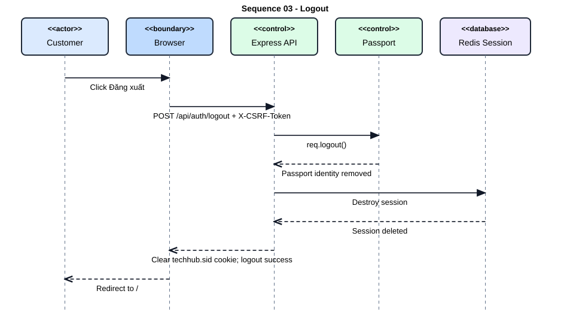
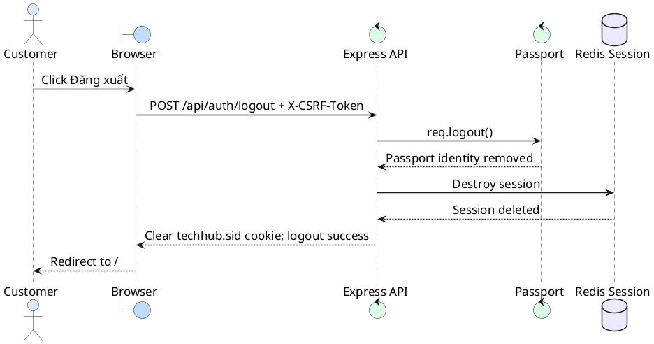

# Sequence 03 - Logout

PlantUML source

```plantuml
@startuml
skinparam defaultFontName Arial
skinparam defaultFontSize 17
skinparam sequenceMessageAlign center
skinparam sequenceArrowThickness 1.5
skinparam ParticipantBorderColor #1F2937
skinparam ActorBorderColor #1F2937
skinparam LifeLineBorderColor #374151
skinparam LifeLineBackgroundColor #FFFFFF
actor "Customer" as Customer #DBEAFE
boundary "Browser" as Browser #BFDBFE
control "Express API" as API #DCFCE7
control "Passport" as Passport #DCFCE7
database "Redis Session" as Session #EDE9FE
Customer -> Browser : Click Đăng xuất
Browser -> API : POST /api/auth/logout + X-CSRF-Token
API -> Passport : req.logout()
Passport --> API : Passport identity removed
API -> Session : Destroy session
Session --> API : Session deleted
API --> Browser : Clear techhub.sid cookie; logout success
Browser --> Customer : Redirect to /
@enduml
```

Related code: `frontend/public/js/account.js`, `src/controllers/authController.js`.