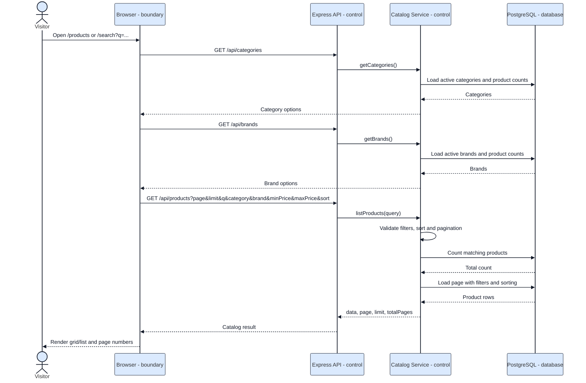

# Sequence 05 - Product Catalog

```mermaid
%%{init: {"theme": "base", "themeVariables": {"fontFamily": "Arial", "signalColor": "#111827", "signalTextColor": "#111827", "actorBkg": "#dbeafe", "actorBorder": "#111827", "actorLineColor": "#111827", "boundaryBkg": "#fef3c7", "boundaryBorder": "#111827", "controlBkg": "#dcfce7", "controlBorder": "#111827", "databaseBkg": "#ede9fe", "databaseBorder": "#111827", "activationBkgColor": "#bfdbfe", "activationBorderColor": "#111827", "labelBoxBkgColor": "#e5e7eb", "labelBoxBorderColor": "#111827"}}}%%
sequenceDiagram
    actor Visitor
    participant Browser as Browser - boundary
    participant API as Express API - control
    participant Catalog as Catalog Service - control
    participant DB as PostgreSQL - database

    Visitor->>Browser: Open /products or /search?q=...
    Browser->>API: GET /api/categories
    API->>Catalog: getCategories()
    Catalog->>DB: Load active categories and product counts
    DB-->>Catalog: Categories
    Catalog-->>Browser: Category options
    Browser->>API: GET /api/brands
    API->>Catalog: getBrands()
    Catalog->>DB: Load active brands and product counts
    DB-->>Catalog: Brands
    Catalog-->>Browser: Brand options
    Browser->>API: GET /api/products?page&limit&q&category&brand&minPrice&maxPrice&sort
    API->>Catalog: listProducts(query)
    Catalog->>Catalog: Validate filters, sort and pagination
    Catalog->>DB: Count matching products
    DB-->>Catalog: Total count
    Catalog->>DB: Load page with filters and sorting
    DB-->>Catalog: Product rows
    Catalog-->>API: data, page, limit, totalPages
    API-->>Browser: Catalog result
    Browser-->>Visitor: Render grid/list and page numbers
```

Related code: `frontend/public/js/catalog.js`, `src/controllers/catalogController.js`, `src/services/catalogService.js`.
