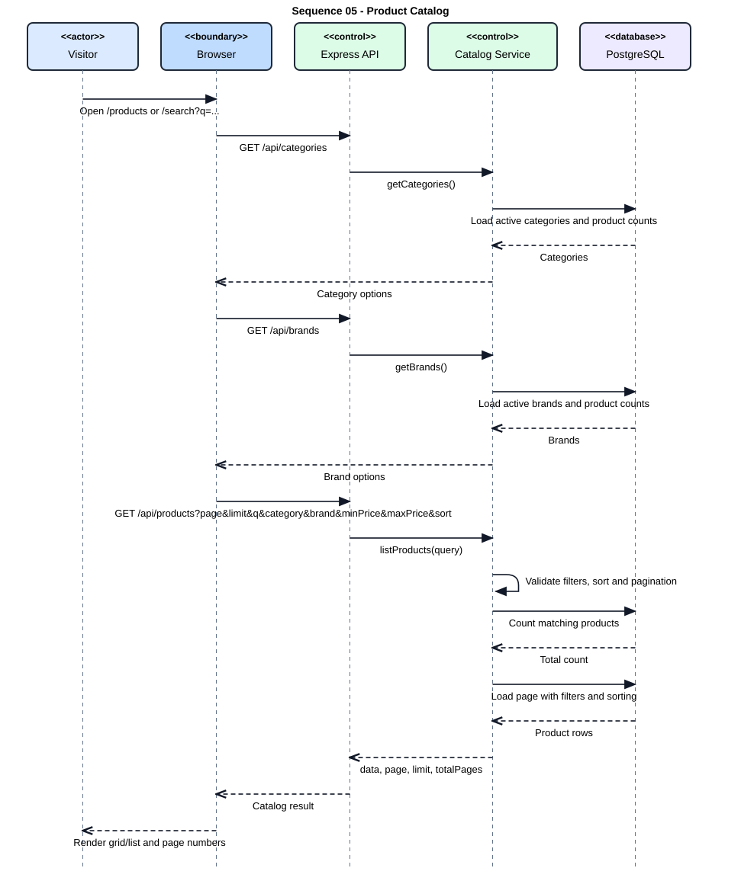
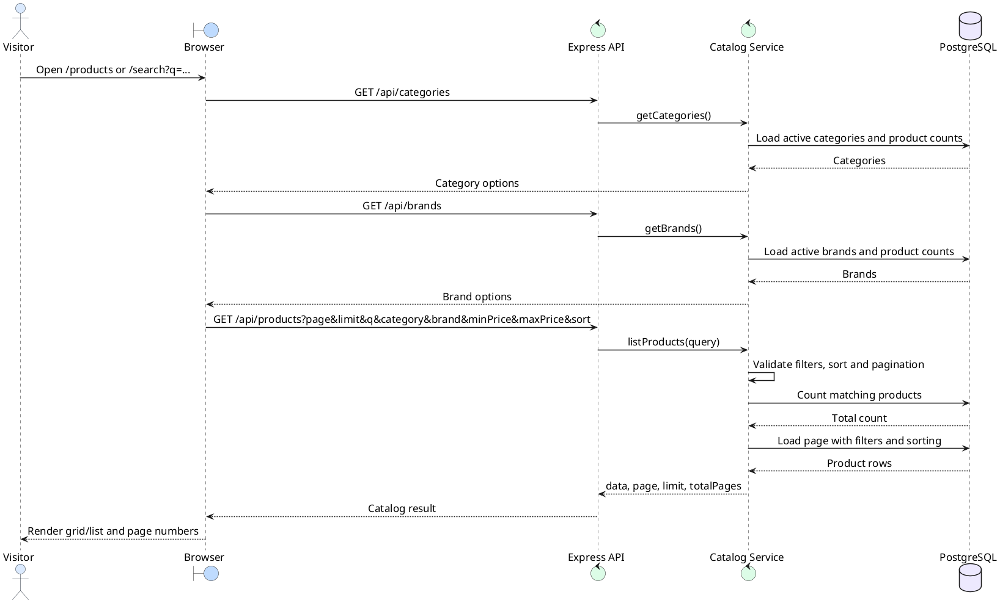

# Sequence 05 - Product Catalog

PlantUML source

```plantuml
@startuml
skinparam defaultFontName Arial
skinparam defaultFontSize 17
skinparam sequenceMessageAlign center
skinparam sequenceArrowThickness 1.5
skinparam ParticipantBorderColor #1F2937
skinparam ActorBorderColor #1F2937
skinparam LifeLineBorderColor #374151
skinparam LifeLineBackgroundColor #FFFFFF
actor "Visitor" as Visitor #DBEAFE
boundary "Browser" as Browser #BFDBFE
control "Express API" as API #DCFCE7
control "Catalog Service" as Catalog #DCFCE7
database "PostgreSQL" as DB #EDE9FE
Visitor -> Browser : Open /products or /search?q=...
Browser -> API : GET /api/categories
API -> Catalog : getCategories()
Catalog -> DB : Load active categories and product counts
DB --> Catalog : Categories
Catalog --> Browser : Category options
Browser -> API : GET /api/brands
API -> Catalog : getBrands()
Catalog -> DB : Load active brands and product counts
DB --> Catalog : Brands
Catalog --> Browser : Brand options
Browser -> API : GET /api/products?page&limit&q&category&brand&minPrice&maxPrice&sort
API -> Catalog : listProducts(query)
Catalog -> Catalog : Validate filters, sort and pagination
Catalog -> DB : Count matching products
DB --> Catalog : Total count
Catalog -> DB : Load page with filters and sorting
DB --> Catalog : Product rows
Catalog --> API : data, page, limit, totalPages
API --> Browser : Catalog result
Browser --> Visitor : Render grid/list and page numbers
@enduml
```

Related code: `frontend/public/js/catalog.js`, `src/controllers/catalogController.js`, `src/services/catalogService.js`.