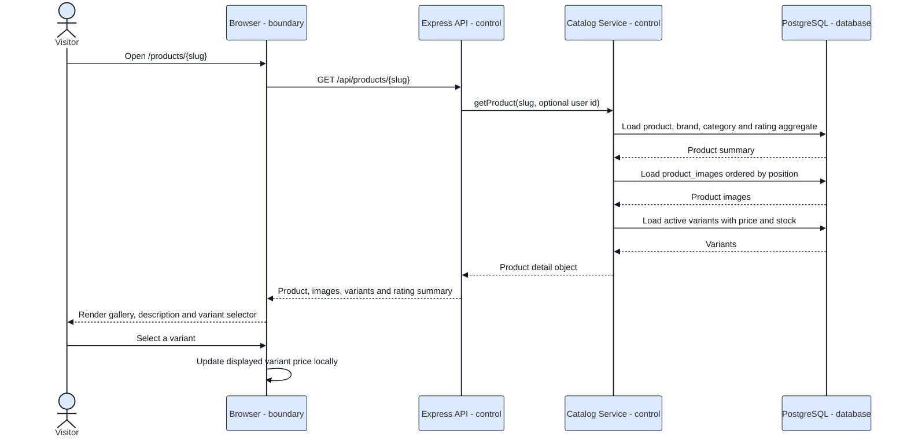

# Sequence 06 - Product Detail

```mermaid
%%{init: {"theme": "base", "themeVariables": {"fontFamily": "Arial", "signalColor": "#111827", "signalTextColor": "#111827", "actorBkg": "#dbeafe", "actorBorder": "#111827", "actorLineColor": "#111827", "boundaryBkg": "#fef3c7", "boundaryBorder": "#111827", "controlBkg": "#dcfce7", "controlBorder": "#111827", "databaseBkg": "#ede9fe", "databaseBorder": "#111827", "activationBkgColor": "#bfdbfe", "activationBorderColor": "#111827", "labelBoxBkgColor": "#e5e7eb", "labelBoxBorderColor": "#111827"}}}%%
sequenceDiagram
    actor Visitor
    participant Browser as Browser - boundary
    participant API as Express API - control
    participant Catalog as Catalog Service - control
    participant DB as PostgreSQL - database

    Visitor->>Browser: Open /products/{slug}
    Browser->>API: GET /api/products/{slug}
    API->>Catalog: getProduct(slug, optional user id)
    Catalog->>DB: Load product, brand, category and rating aggregate
    DB-->>Catalog: Product summary
    Catalog->>DB: Load product_images ordered by position
    DB-->>Catalog: Product images
    Catalog->>DB: Load active variants with price and stock
    DB-->>Catalog: Variants
    Catalog-->>API: Product detail object
    API-->>Browser: Product, images, variants and rating summary
    Browser-->>Visitor: Render gallery, description and variant selector
    Visitor->>Browser: Select a variant
    Browser->>Browser: Update displayed variant price locally
```

Related code: `frontend/public/js/product.js`, `frontend/views/product.ejs`, `src/services/catalogService.js`.
