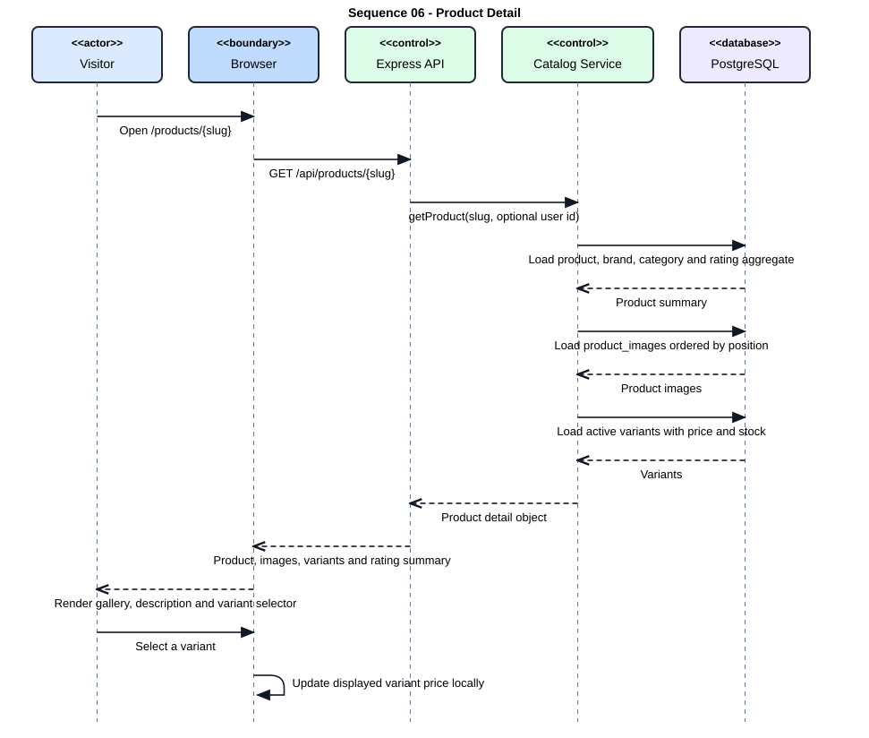
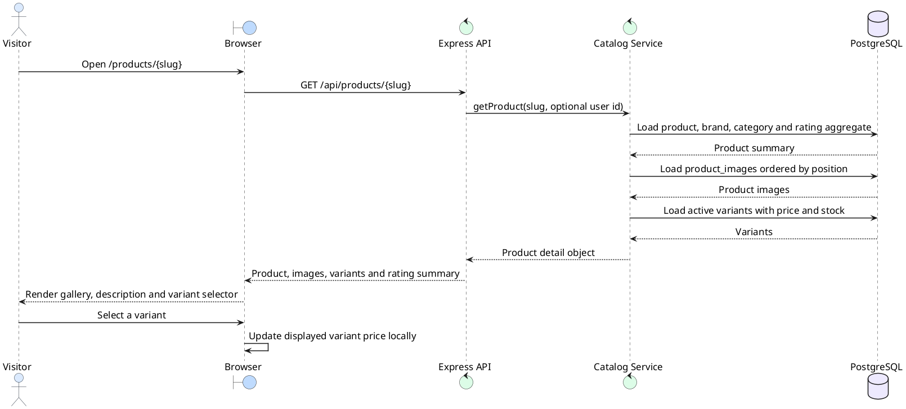

# Sequence 06 - Product Detail

PlantUML source

```plantuml
@startuml
skinparam defaultFontName Arial
skinparam defaultFontSize 17
skinparam sequenceMessageAlign center
skinparam sequenceArrowThickness 1.5
skinparam ParticipantBorderColor #1F2937
skinparam ActorBorderColor #1F2937
skinparam LifeLineBorderColor #374151
skinparam LifeLineBackgroundColor #FFFFFF
actor "Visitor" as Visitor #DBEAFE
boundary "Browser" as Browser #BFDBFE
control "Express API" as API #DCFCE7
control "Catalog Service" as Catalog #DCFCE7
database "PostgreSQL" as DB #EDE9FE
Visitor -> Browser : Open /products/{slug}
Browser -> API : GET /api/products/{slug}
API -> Catalog : getProduct(slug, optional user id)
Catalog -> DB : Load product, brand, category and rating aggregate
DB --> Catalog : Product summary
Catalog -> DB : Load product_images ordered by position
DB --> Catalog : Product images
Catalog -> DB : Load active variants with price and stock
DB --> Catalog : Variants
Catalog --> API : Product detail object
API --> Browser : Product, images, variants and rating summary
Browser --> Visitor : Render gallery, description and variant selector
Visitor -> Browser : Select a variant
Browser -> Browser : Update displayed variant price locally
@enduml
```

Related code: `frontend/public/js/product.js`, `frontend/views/product.ejs`, `src/services/catalogService.js`.