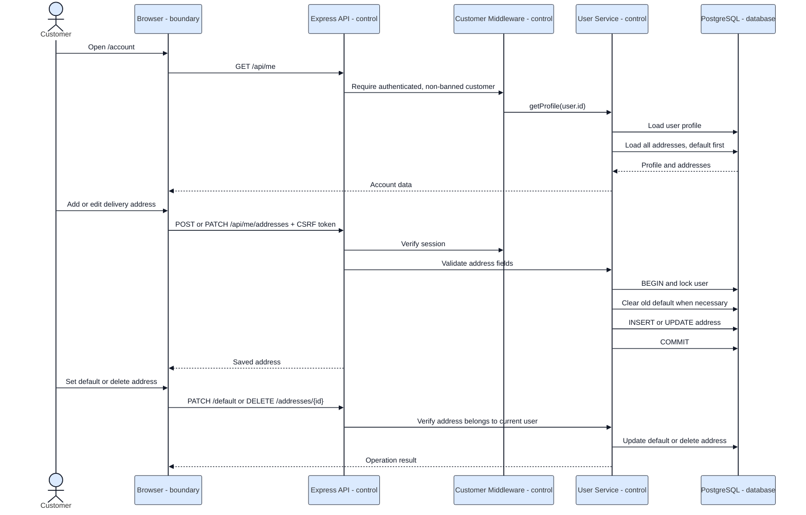

# Sequence 08 - Profile and Delivery Addresses

```mermaid
%%{init: {"theme": "base", "themeVariables": {"fontFamily": "Arial", "signalColor": "#111827", "signalTextColor": "#111827", "actorBkg": "#dbeafe", "actorBorder": "#111827", "actorLineColor": "#111827", "boundaryBkg": "#fef3c7", "boundaryBorder": "#111827", "controlBkg": "#dcfce7", "controlBorder": "#111827", "databaseBkg": "#ede9fe", "databaseBorder": "#111827", "activationBkgColor": "#bfdbfe", "activationBorderColor": "#111827", "labelBoxBkgColor": "#e5e7eb", "labelBoxBorderColor": "#111827"}}}%%
sequenceDiagram
    actor Customer
    participant Browser as Browser - boundary
    participant API as Express API - control
    participant Auth as Customer Middleware - control
    participant Users as User Service - control
    participant DB as PostgreSQL - database

    Customer->>Browser: Open /account
    Browser->>API: GET /api/me
    API->>Auth: Require authenticated, non-banned customer
    Auth->>Users: getProfile(user.id)
    Users->>DB: Load user profile
    Users->>DB: Load all addresses, default first
    DB-->>Users: Profile and addresses
    Users-->>Browser: Account data

    Customer->>Browser: Add or edit delivery address
    Browser->>API: POST or PATCH /api/me/addresses + CSRF token
    API->>Auth: Verify session
    API->>Users: Validate address fields
    Users->>DB: BEGIN and lock user
    Users->>DB: Clear old default when necessary
    Users->>DB: INSERT or UPDATE address
    Users->>DB: COMMIT
    API-->>Browser: Saved address

    Customer->>Browser: Set default or delete address
    Browser->>API: PATCH /default or DELETE /addresses/{id}
    API->>Users: Verify address belongs to current user
    Users->>DB: Update default or delete address
    Users-->>Browser: Operation result
```

Related code: `frontend/public/js/account.js`, `src/controllers/profileController.js`, `src/services/users.js`.
