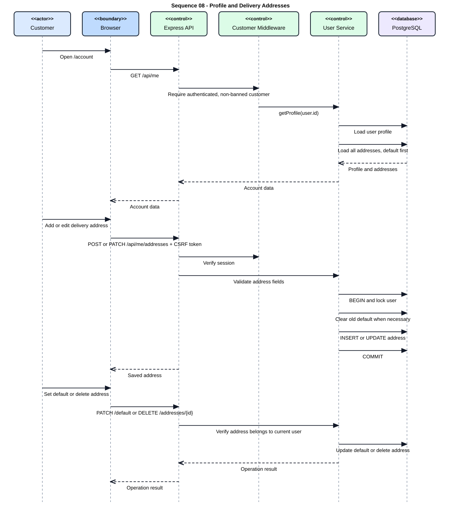
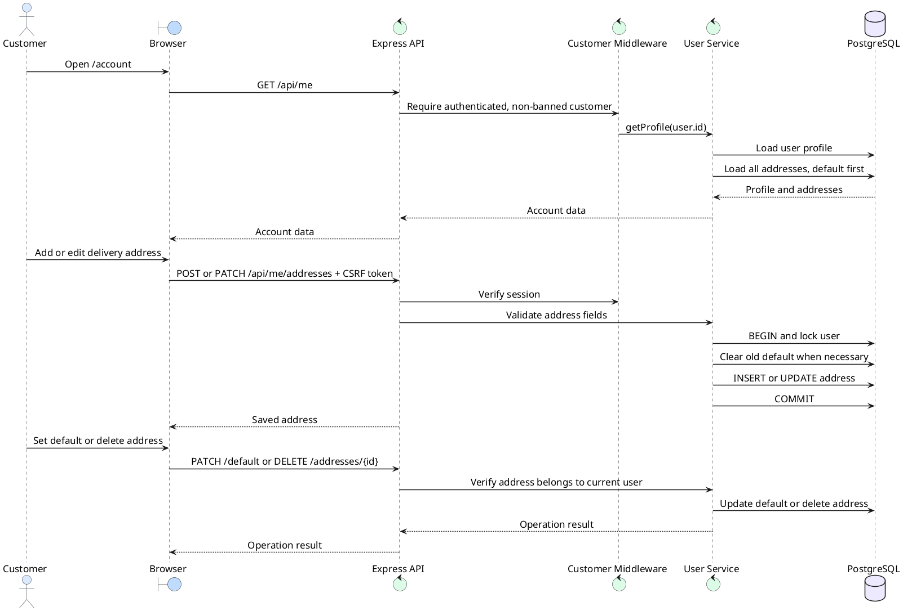

# Sequence 08 - Profile and Delivery Addresses

PlantUML source

```plantuml
@startuml
skinparam defaultFontName Arial
skinparam defaultFontSize 17
skinparam sequenceMessageAlign center
skinparam sequenceArrowThickness 1.5
skinparam ParticipantBorderColor #1F2937
skinparam ActorBorderColor #1F2937
skinparam LifeLineBorderColor #374151
skinparam LifeLineBackgroundColor #FFFFFF
actor "Customer" as Customer #DBEAFE
boundary "Browser" as Browser #BFDBFE
control "Express API" as API #DCFCE7
control "Customer Middleware" as Auth #DCFCE7
control "User Service" as Users #DCFCE7
database "PostgreSQL" as DB #EDE9FE
Customer -> Browser : Open /account
Browser -> API : GET /api/me
API -> Auth : Require authenticated, non-banned customer
Auth -> Users : getProfile(user.id)
Users -> DB : Load user profile
Users -> DB : Load all addresses, default first
DB --> Users : Profile and addresses
Users --> API : Account data
API --> Browser : Account data
Customer -> Browser : Add or edit delivery address
Browser -> API : POST or PATCH /api/me/addresses + CSRF token
API -> Auth : Verify session
API -> Users : Validate address fields
Users -> DB : BEGIN and lock user
Users -> DB : Clear old default when necessary
Users -> DB : INSERT or UPDATE address
Users -> DB : COMMIT
API --> Browser : Saved address
Customer -> Browser : Set default or delete address
Browser -> API : PATCH /default or DELETE /addresses/{id}
API -> Users : Verify address belongs to current user
Users -> DB : Update default or delete address
Users --> API : Operation result
API --> Browser : Operation result
@enduml
```

Related code: `frontend/public/js/account.js`, `src/controllers/profileController.js`, `src/services/users.js`.