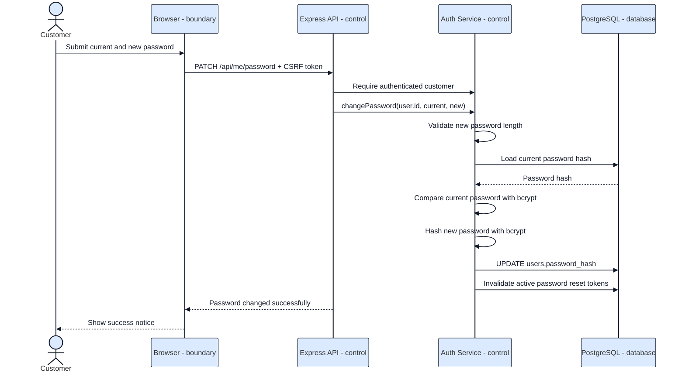

# Sequence 09 - Change Password

```mermaid
%%{init: {"theme": "base", "themeVariables": {"fontFamily": "Arial", "signalColor": "#111827", "signalTextColor": "#111827", "actorBkg": "#dbeafe", "actorBorder": "#111827", "actorLineColor": "#111827", "boundaryBkg": "#fef3c7", "boundaryBorder": "#111827", "controlBkg": "#dcfce7", "controlBorder": "#111827", "databaseBkg": "#ede9fe", "databaseBorder": "#111827", "activationBkgColor": "#bfdbfe", "activationBorderColor": "#111827", "labelBoxBkgColor": "#e5e7eb", "labelBoxBorderColor": "#111827"}}}%%
sequenceDiagram
    actor Customer
    participant Browser as Browser - boundary
    participant API as Express API - control
    participant Auth as Auth Service - control
    participant DB as PostgreSQL - database

    Customer->>Browser: Submit current and new password
    Browser->>API: PATCH /api/me/password + CSRF token
    API->>Auth: Require authenticated customer
    API->>Auth: changePassword(user.id, current, new)
    Auth->>Auth: Validate new password length
    Auth->>DB: Load current password hash
    DB-->>Auth: Password hash
    Auth->>Auth: Compare current password with bcrypt
    Auth->>Auth: Hash new password with bcrypt
    Auth->>DB: UPDATE users.password_hash
    Auth->>DB: Invalidate active password reset tokens
    API-->>Browser: Password changed successfully
    Browser-->>Customer: Show success notice
```

Related code: `frontend/public/js/account.js`, `src/controllers/profileController.js`, `src/services/auth.js`.
