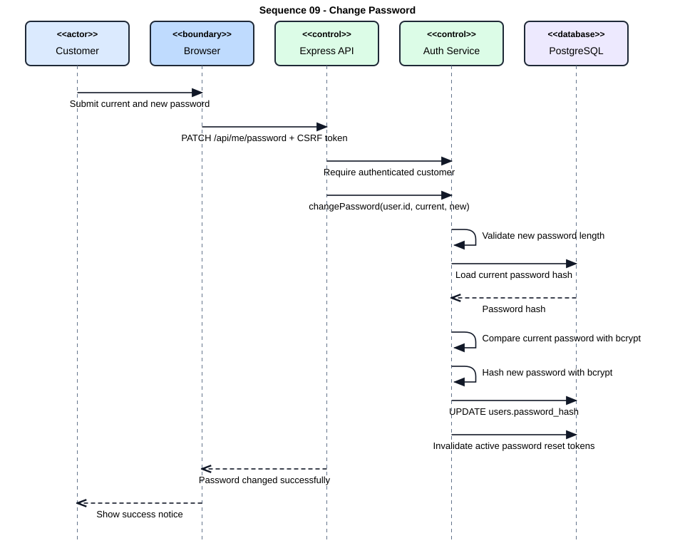
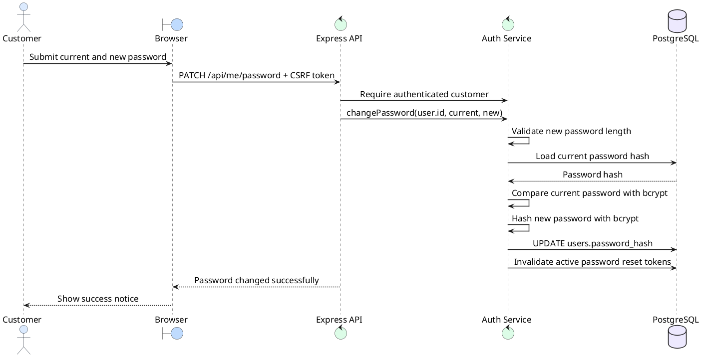

# Sequence 09 - Change Password

PlantUML source

```plantuml
@startuml
skinparam defaultFontName Arial
skinparam defaultFontSize 17
skinparam sequenceMessageAlign center
skinparam sequenceArrowThickness 1.5
skinparam ParticipantBorderColor #1F2937
skinparam ActorBorderColor #1F2937
skinparam LifeLineBorderColor #374151
skinparam LifeLineBackgroundColor #FFFFFF
actor "Customer" as Customer #DBEAFE
boundary "Browser" as Browser #BFDBFE
control "Express API" as API #DCFCE7
control "Auth Service" as Auth #DCFCE7
database "PostgreSQL" as DB #EDE9FE
Customer -> Browser : Submit current and new password
Browser -> API : PATCH /api/me/password + CSRF token
API -> Auth : Require authenticated customer
API -> Auth : changePassword(user.id, current, new)
Auth -> Auth : Validate new password length
Auth -> DB : Load current password hash
DB --> Auth : Password hash
Auth -> Auth : Compare current password with bcrypt
Auth -> Auth : Hash new password with bcrypt
Auth -> DB : UPDATE users.password_hash
Auth -> DB : Invalidate active password reset tokens
API --> Browser : Password changed successfully
Browser --> Customer : Show success notice
@enduml
```

Related code: `frontend/public/js/account.js`, `src/controllers/profileController.js`, `src/services/auth.js`.