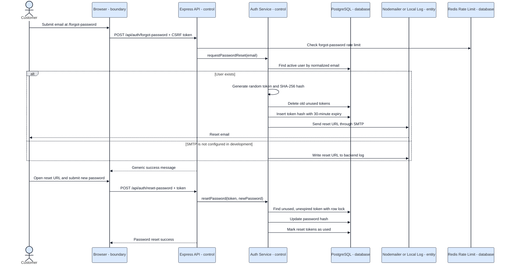

# Sequence 10 - Password Recovery

```mermaid
%%{init: {"theme": "base", "themeVariables": {"fontFamily": "Arial", "signalColor": "#111827", "signalTextColor": "#111827", "actorBkg": "#dbeafe", "actorBorder": "#111827", "actorLineColor": "#111827", "boundaryBkg": "#fef3c7", "boundaryBorder": "#111827", "controlBkg": "#dcfce7", "controlBorder": "#111827", "databaseBkg": "#ede9fe", "databaseBorder": "#111827", "entityBkg": "#fee2e2", "entityBorder": "#111827", "activationBkgColor": "#bfdbfe", "activationBorderColor": "#111827", "labelBoxBkgColor": "#e5e7eb", "labelBoxBorderColor": "#111827"}}}%%
sequenceDiagram
    actor Customer
    participant Browser as Browser - boundary
    participant API as Express API - control
    participant Auth as Auth Service - control
    participant DB as PostgreSQL - database
    participant Mailer as Nodemailer or Local Log - entity
    participant Redis as Redis Rate Limit - database

    Customer->>Browser: Submit email at /forgot-password
    Browser->>API: POST /api/auth/forgot-password + CSRF token
    API->>Redis: Check forgot-password rate limit
    API->>Auth: requestPasswordReset(email)
    Auth->>DB: Find active user by normalized email
    alt User exists
        Auth->>Auth: Generate random token and SHA-256 hash
        Auth->>DB: Delete old unused tokens
        Auth->>DB: Insert token hash with 30-minute expiry
        Auth->>Mailer: Send reset URL through SMTP
        Mailer-->>Customer: Reset email
    else SMTP is not configured in development
        Auth->>Mailer: Write reset URL to backend log
    end
    API-->>Browser: Generic success message

    Customer->>Browser: Open reset URL and submit new password
    Browser->>API: POST /api/auth/reset-password + token
    API->>Auth: resetPassword(token, newPassword)
    Auth->>DB: Find unused, unexpired token with row lock
    Auth->>DB: Update password hash
    Auth->>DB: Mark reset tokens as used
    API-->>Browser: Password reset success
```

Related code: `frontend/public/js/auth.js`, `src/services/auth.js`, `src/services/mailer.js`.
