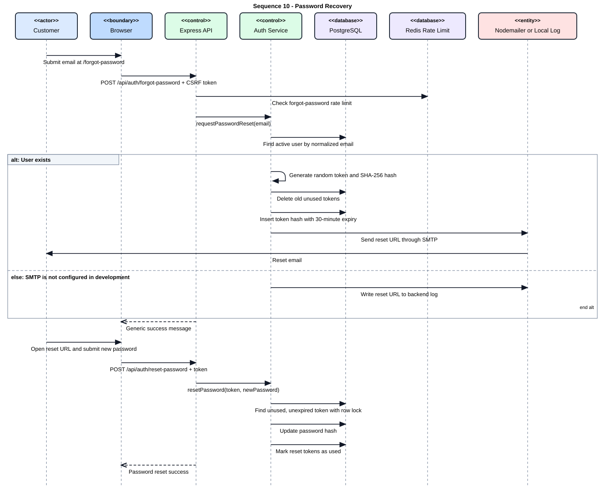
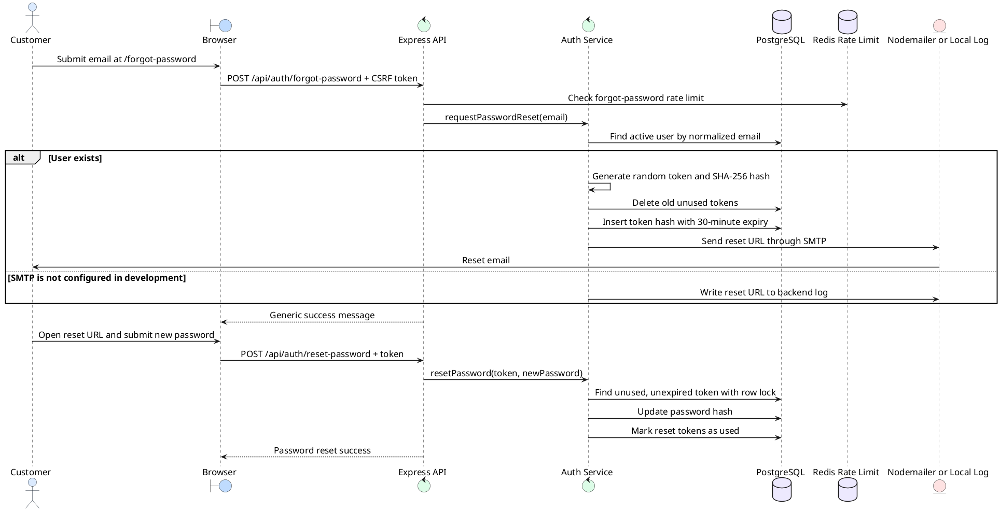

# Sequence 10 - Password Recovery

PlantUML source

```plantuml
@startuml
skinparam defaultFontName Arial
skinparam defaultFontSize 17
skinparam sequenceMessageAlign center
skinparam sequenceArrowThickness 1.5
skinparam ParticipantBorderColor #1F2937
skinparam ActorBorderColor #1F2937
skinparam LifeLineBorderColor #374151
skinparam LifeLineBackgroundColor #FFFFFF
actor "Customer" as Customer #DBEAFE
boundary "Browser" as Browser #BFDBFE
control "Express API" as API #DCFCE7
control "Auth Service" as Auth #DCFCE7
database "PostgreSQL" as DB #EDE9FE
database "Redis Rate Limit" as Redis #EDE9FE
entity "Nodemailer or Local Log" as Mailer #FEE2E2
Customer -> Browser : Submit email at /forgot-password
Browser -> API : POST /api/auth/forgot-password + CSRF token
API -> Redis : Check forgot-password rate limit
API -> Auth : requestPasswordReset(email)
Auth -> DB : Find active user by normalized email
alt User exists
Auth -> Auth : Generate random token and SHA-256 hash
Auth -> DB : Delete old unused tokens
Auth -> DB : Insert token hash with 30-minute expiry
Auth -> Mailer : Send reset URL through SMTP
Mailer -> Customer : Reset email
else SMTP is not configured in development
Auth -> Mailer : Write reset URL to backend log
end
API --> Browser : Generic success message
Customer -> Browser : Open reset URL and submit new password
Browser -> API : POST /api/auth/reset-password + token
API -> Auth : resetPassword(token, newPassword)
Auth -> DB : Find unused, unexpired token with row lock
Auth -> DB : Update password hash
Auth -> DB : Mark reset tokens as used
API --> Browser : Password reset success
@enduml
```

Related code: `frontend/public/js/auth.js`, `src/services/auth.js`, `src/services/mailer.js`.